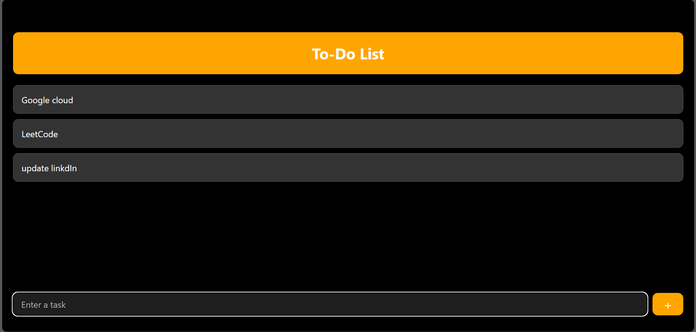
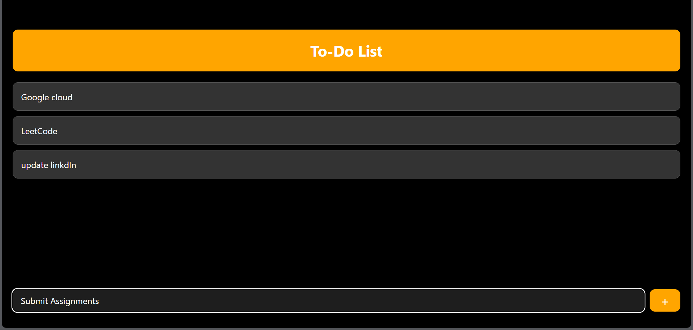
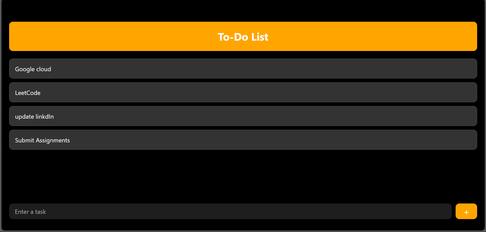
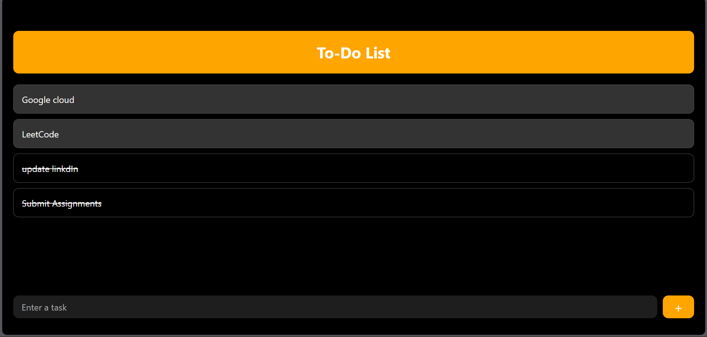
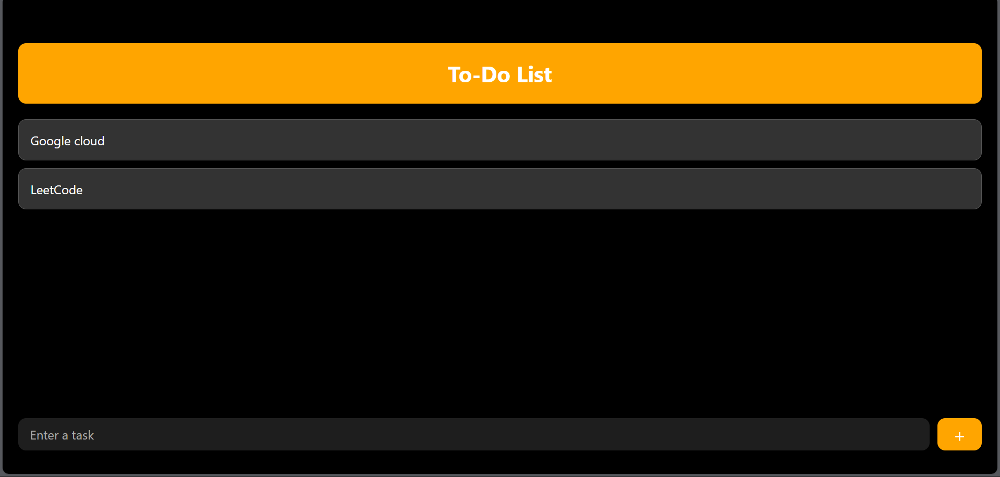
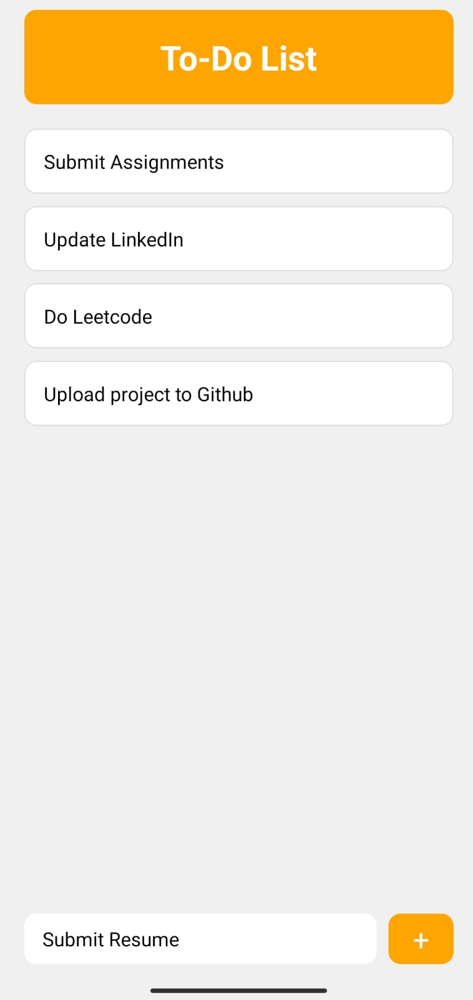
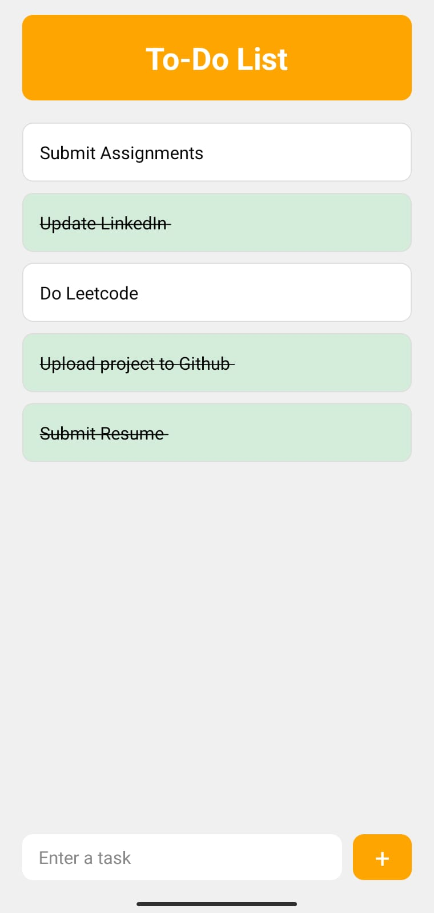
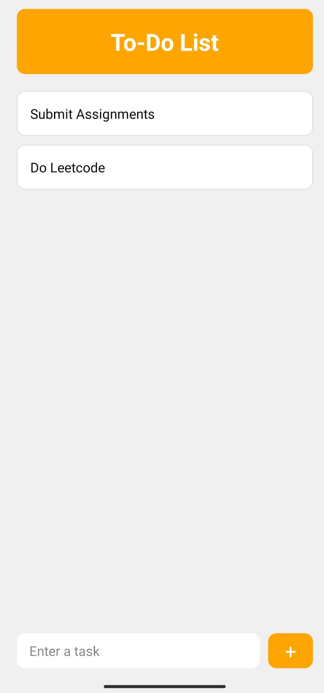

---

# ✅ React Native To-Do List App

A simple and elegant **To-Do List application** built with **React Native & Expo**.  
This app allows users to add, delete, and manage tasks efficiently, with support for **dark mode**.  

---

## ✨ Features
- ➕ Add new tasks  
- ❌ Delete tasks  
- 🌙 Dark mode support  
- 📱 Works on Android, iOS, and Web (via Expo)  

---

## 📂 Project Structure

📦 react-native-todo-list/
├── 📁 assets/ # Images & static assets
│ └── 📁 screenshots/ # App screenshots
├── 📁 node_modules/ # Dependencies (ignored in GitHub)
├── 📄 App.js # Main app component
├── 📄 index.js # Entry point
├── ⚙️ app.json # Expo configuration
├── 📦 package.json # Project metadata & dependencies
└── 📝 .gitignore # Ignored files (node_modules, etc.)

---

## 🛠️ Tech Stack
- ⚛️ React Native
- 📱 Expo SDK 53
- 💾 AsyncStorage (for local data)
- 🎨 Styled Components / CSS
 
---

## 🤝 Contributing
Contributions, issues, and feature requests are welcome!  
Feel free to fork this repo and submit a PR.

---

## 📜 License
This project is licensed under the MIT License.  

---

## 📸 Screenshots

| In Web|
|------------|
|  | 
|  | 
|  |
|  | 
|  |

| In Mobile|
|------------|
|  | 
|  | 
|  |
|  | 

---
# ⚡ Installation & Running

## 🛠 Prerequisites
Before you begin, make sure you have the following installed:

- [Node.js](https://nodejs.org/) (LTS version recommended)
- [npm](https://www.npmjs.com/) (comes with Node.js)
- [Expo CLI](https://docs.expo.dev/get-started/installation/)  
  Install globally if not already installed:

  npm install -g expo-cli

### 1️⃣ Clone the repository

git clone https://github.com/your-username/react-native-todo-list.git
cd react-native-todo-list

### 2️⃣ Install dependencies
npm install

### 3️⃣ Run the project (📱 Mobile)
#### Start the Expo development server:
npx expo start
#### On Mobile: Scan the QR code with the Expo Go app (Android/iOS).

### 4️⃣ Run the project (💻 Web)
npx expo start --web
#### Or press w in the terminal when the server starts.

